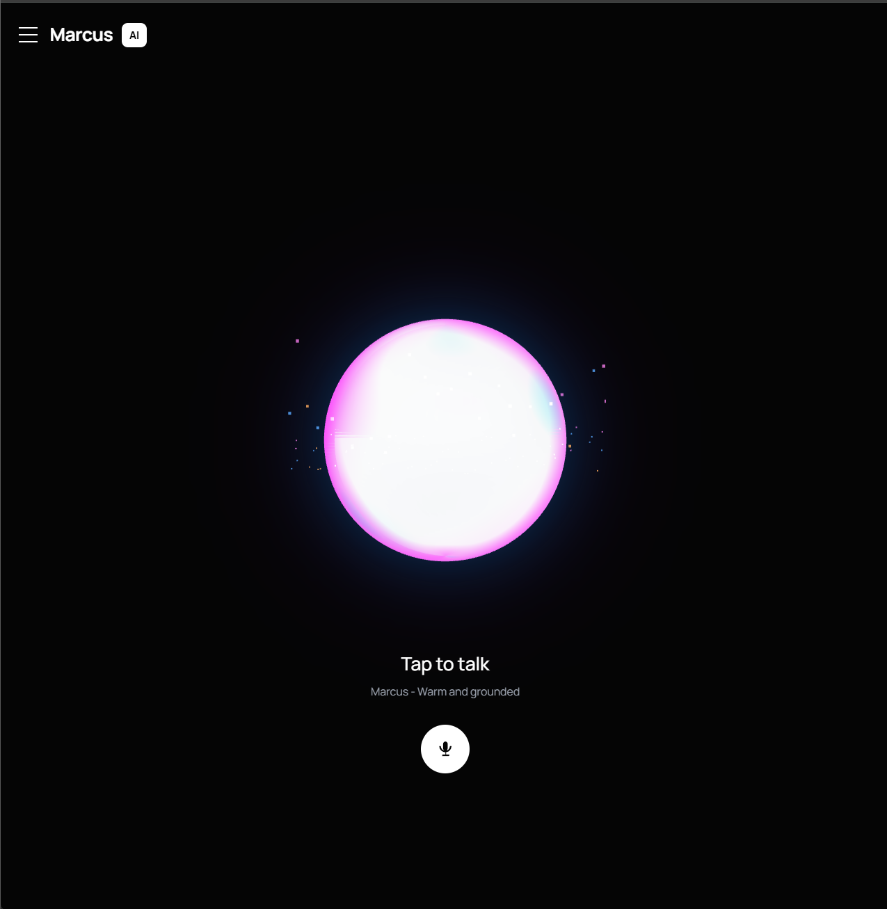
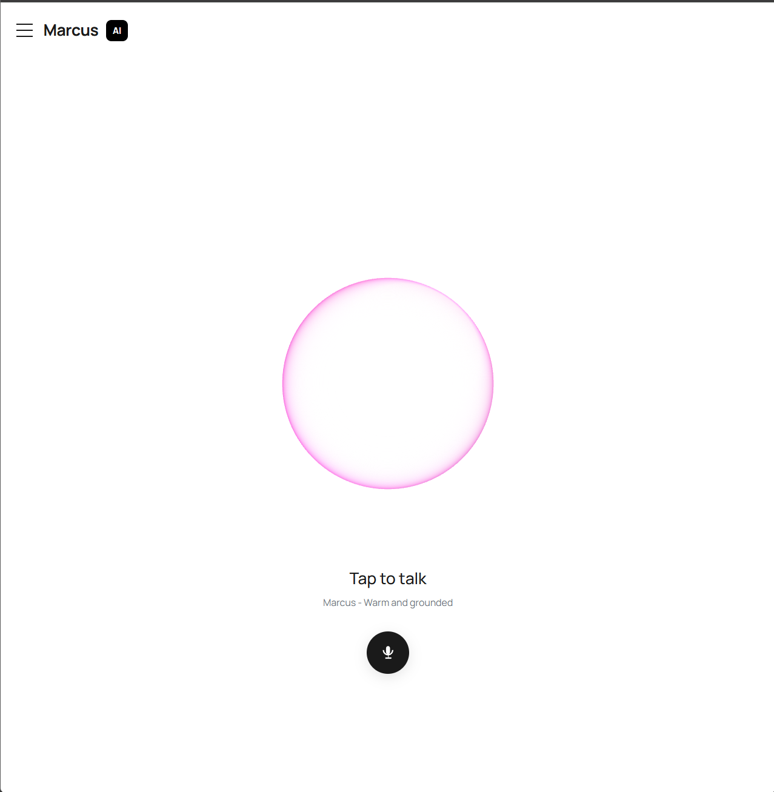
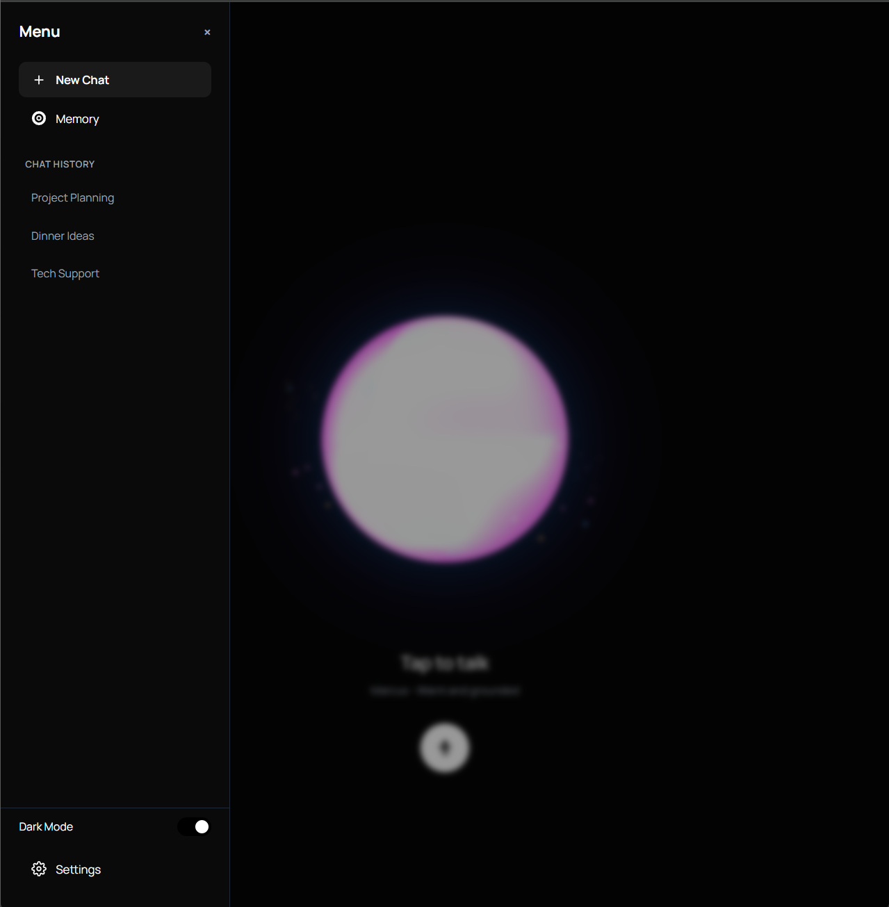

<div align="center">


# Marcus V.A
### DedSec Voice Assistant

> *A cinematic, DedSec-themed AI voice assistant powered by Groq Whisper, ElevenLabs TTS, and a living orb UI.*

[](https://python.org)
[](https://groq.com)
[](https://elevenlabs.io)
[](LICENSE)

</div>

---

## Screenshots

<div align="center">

| Dark Mode | Light Mode |
|:---------:|:----------:|
|  |  |

**Menu Screen**



</div>

---

## Features

- 🎙 **Wake Word Detection** — hands-free activation, always listening
- 🧠 **Groq Whisper STT** — blazing-fast speech-to-text via `whisper-large-v3-turbo`
- 🔊 **ElevenLabs TTS** — natural voice synthesis with emotional range
- 🌐 **Living Orb UI** — fluid, morphing orb that reacts to every state (idle / listening / thinking / speaking)
- 💬 **Chat Interface** — DedSec-themed tkinter chat with streaming responses
- 🧩 **Modular Commands** — file, web, system, and extra command modules
- 🗂 **Persistent Memory** — conversation context stored across sessions
- ⌨ **Shortcut Engine** — configurable keyboard shortcuts
- 💀 **Glitch Mode** — DedSec aesthetic Easter egg

---

## Project Structure

```
Marcus_V.A/
├── marcus/
│   ├── commands/
│   │   ├── base.py          # Core command dispatcher
│   │   ├── extras.py        # Extra utility commands
│   │   ├── files.py         # File system commands
│   │   ├── system.py        # OS-level commands
│   │   └── web.py           # Web/search commands
│   ├── core/
│   │   ├── ai.py            # Groq LLM integration
│   │   ├── memory.py        # Persistent memory engine
│   │   └── router.py        # Intent router
│   └── utils/
│       ├── listener.py      # Wake word + mic listener
│       ├── shortcuts.py     # Keyboard shortcut handler
│       └── speech.py        # ElevenLabs TTS wrapper
├── data/
│   ├── logs/
│   │   └── conversation.log
│   ├── memory.json          # Persistent memory store
│   ├── profile.json         # User profile
│   ├── shortcuts.json       # Shortcut config
│   └── summary.json         # Session summaries
├── pics/                    # UI screenshots
├── gui.py                   # tkinter chat GUI
├── ui.html                  # Orb UI (pywebview)
├── main.py                  # CLI entry point
├── config.py                # Global config
├── MIC_DEBUG.py             # Microphone debug tool
├── .env                     # API keys (not committed)
├── requirements.txt
└── README.md
```

---

## Installation

### 1. Clone the repo

```bash
git clone https://github.com/ShamGaneshan2008/Marcus_V.A.git
cd Marcus_V.A
```

### 2. Create a virtual environment

```bash
python -m venv .venv
.venv\Scripts\activate       # Windows
```

### 3. Install dependencies

```bash
pip install -r requirements.txt
```

### 4. Set up your `.env` file

Create a `.env` file in the project root:

```env
GROQ_API_KEY=your_groq_api_key_here
ELEVENLABS_API_KEY=your_elevenlabs_api_key_here
ELEVENLABS_VOICE_ID=your_voice_id_here
```

> ⚠️ Never commit your `.env` file. It is already in `.gitignore`.

---

## Usage

### Launch the GUI

```bash
python gui.py
```

### Run via CLI (single command)

```bash
python main.py --cmd "What's the weather today?"
```

### Debug your microphone

```bash
python MIC_DEBUG.py
```

---

## Tech Stack

| Layer | Technology |
|-------|------------|
| GUI | `tkinter` + `pywebview` |
| Orb UI | HTML5 Canvas / vanilla JS |
| STT | Groq `whisper-large-v3-turbo` |
| LLM | Groq API |
| TTS | ElevenLabs |
| Wake Word | `speech_recognition` |
| Memory | JSON-based persistent store |
| Config | `python-dotenv` |

---

## Orb States

The living orb UI changes color and animation based on Marcus's state:

| State | Color | Behavior |
|-------|-------|----------|
| **Idle** | 🔵 Blue | Slow, breathing drift |
| **Listening** | 🟢 Green | Faster, energetic wobble |
| **Thinking** | 🟣 Purple | Rapid morphing |
| **Speaking** | 🌀 Deep violet | Pulses with voice rhythm |

---

## Configuration

Edit `config.py` to change:
- Default microphone device index
- Wake word phrase
- Memory window size
- TTS voice settings

---

## Roadmap

- [ ] Web dashboard (FastAPI backend)
- [ ] Multi-language support
- [ ] Plugin system for custom commands
- [ ] Local LLM support (Ollama)
- [ ] Mobile companion app

---

## Contributing

Pull requests are welcome. For major changes, open an issue first.

1. Fork the repo
2. Create your branch: `git checkout -b feature/my-feature`
3. Commit: `git commit -m "Add my feature"`
4. Push: `git push origin feature/my-feature`
5. Open a Pull Request

---

## License

[MIT](LICENSE) © [ShamGaneshan2008](https://github.com/ShamGaneshan2008)

---

<div align="center">

*Built with 🔥 by ShamGaneshan — DedSec V.A Project*

</div>